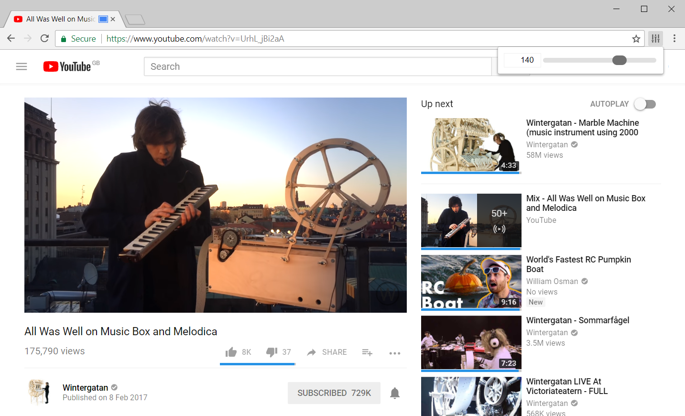

# Tab Volume
Tab volume allows you to set different volume levels per tab in chrome. The volume levels are mapped exponentially this means 50 is a gain of 0.25, 100 is a gain of 1, and 200 is a gain of 4. It remembers preveously selected volume levels for each domain and use those when loading up the page again.

The extension works by using the capture tab functionality. It records and returns the audio of the tab whilst passing it through a gain filter that is controlled by the pop-up.

Due to security limitations placed upon the tab capture function the extension will run as soon as the button for it is clicked as the active tab permission needs to be invoked.
