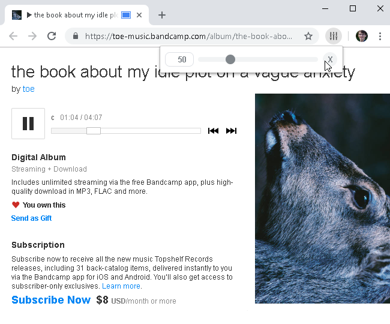
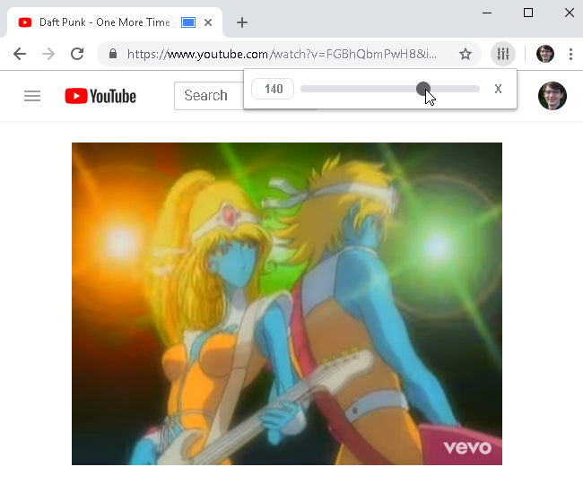

# Tab Volume

Tab volume allows you to control volume levels per tab in in the browser. The volume levels are mapped exponentially this means 50 is a gain of 0.25, 100 is a gain of 1, and 200 is a gain of 4. It remembers previously selected volume levels for each domain and use those when activating the pop-up again.

The extension works by using the capture tab functionality. It records and returns the audio of the tab whilst passing it through a gain filter that is controlled by the pop-up.

Due to security limitations placed upon the tab capture function the extension will run as soon as the button for it is clicked as the active tab permission needs to be invoked.

## Screenshots

<div align="center">

  [](https://toe-music.bandcamp.com/album/the-book-about-my-idle-plot-on-a-vague-anxiety)
  
  [](https://youtu.be/FGBhQbmPwH8)
  
</div>

## Compatibility

The add-on requires the [tabCapture API](https://developer.chrome.com/extensions/tabCapture) and therefore only works on Google Chrome for now.

## Install

Clone the repository to the a directory on your local drive.

```
git clone git@github.com:RedKenrok/Browser-TabVolume.git
```

Then install the add-on to your browser.

On Google Chrome:
1. Go to `chrome://extensions` using the URL bar.
2. In the top right enable `Developer mode`.
3. Click on `Load unpacked`, navigate to the location of the repository.
4. Select the `src` directory and click on `ok`.

## License

[ISC license](https://github.com/RedKenrok/Browser-TabVolume/blob/master/LICENSE)